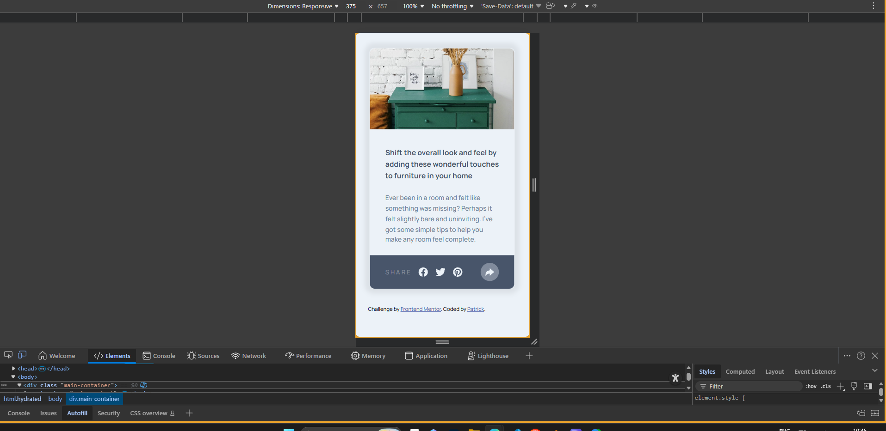
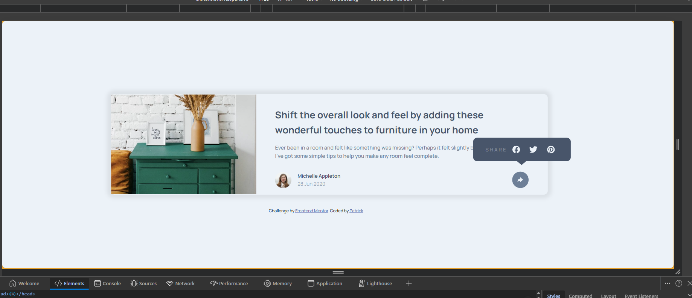

# Frontend Mentor - Article preview component solution

This is a solution to the [Article preview component challenge on Frontend Mentor](https://www.frontendmentor.io/challenges/article-preview-component-dYBN_pYFT). Frontend Mentor challenges help you improve your coding skills by building realistic projects. 

## Table of contents

- [Overview](#overview)
  - [The challenge](#the-challenge)
  - [Screenshots](#screenshots)
  - [Links](#links)
- [My process](#my-process)
  - [Built with](#built-with)
  - [What I learned](#what-i-learned)
  - [Continued development](#continued-development)
  - [Useful resources](#useful-resources)
  - [AI Collaboration](#ai-collaboration)
- [Author](#author)
- [Acknowledgments](#acknowledgments)

## Overview

### The challenge

### Screenshots

### Links

- Solution URL: [Add solution URL here](https://github.com/ryx-dev03/FM-challnege-JS1.git)
- Live Site URL: [Add live site URL here](https://ryx-dev03.github.io/FM-challnege-JS1/)

## My process

### Built with

- Semantic HTML5 markup
- CSS custom properties
- Flexbox
- CSS Grid
- Mobile-first workflow

### What I learned

I learnt a lot. From how important html structuring is, to how to properly structure it. Understanding CSS positioning and pseudo elements was crucial for this challenge as well. I also touched on Javascript toggle method as I was learning how to listen and handle events with event listeners in Javascript. 

### Continued development

I still want to work with positioning, pseudo elements, and Javascript

### Useful resources

- [Example resource 1](https://mdnwebdocs) - Helped me understand a ton about positioning 
- [Example resource 2](frontendmentor github channel) - This was where I saw how to structure a html structures properly 

### AI Collaboration

I use grok to chatgpt and grok to understand what was wrong with my layout when it kept breaking. I understood how important proper structuring can be. 

## Author

- Frontend Mentor - [@ryx-dev03](https://www.frontendmentor.io/profile/ryx-dev03)
- Twitter - [@ryx_dev](https://www.twitter.com/ryx_dev)

## Acknowledgments

Highly grateful to frontend mentor for this challenge and for their wonderful discord community. It is truly an honour.

